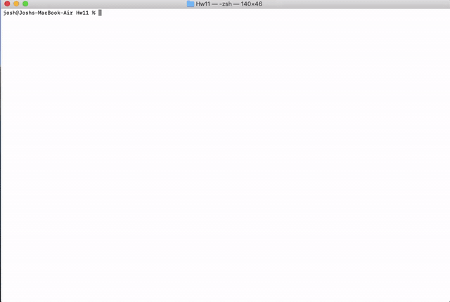

# Note Taker


A Note Taker app, powered by express backend, is created that allows the user to take notes and save them to a database. The stored notes are displayed on the left hand side of the screen. Here the user can add/save more notes and view or delete saved notes. However, for the time being, no coding has been done to edit/modify the saved notes, and this can be done as future work. The Note Taker Web App has also been deployed at heroku website and its link is given below.

## Installation
```
npm install
```

## Usage
```
node server.js
```

## Known issues
```
Cannot edit/modify the saved notes. For the timebeing, they can only be viewed, added or deleted.
```

## License
This project is licensed under MIT 

[](https://opensource.org/licenses/MIT)


## Note Taker HTML
https://joshb4u-notetaker.herokuapp.com/


## Video Link
https://joshb4u.github.io/Hw11/Assets/video.mp4


## Preview (GIF)


